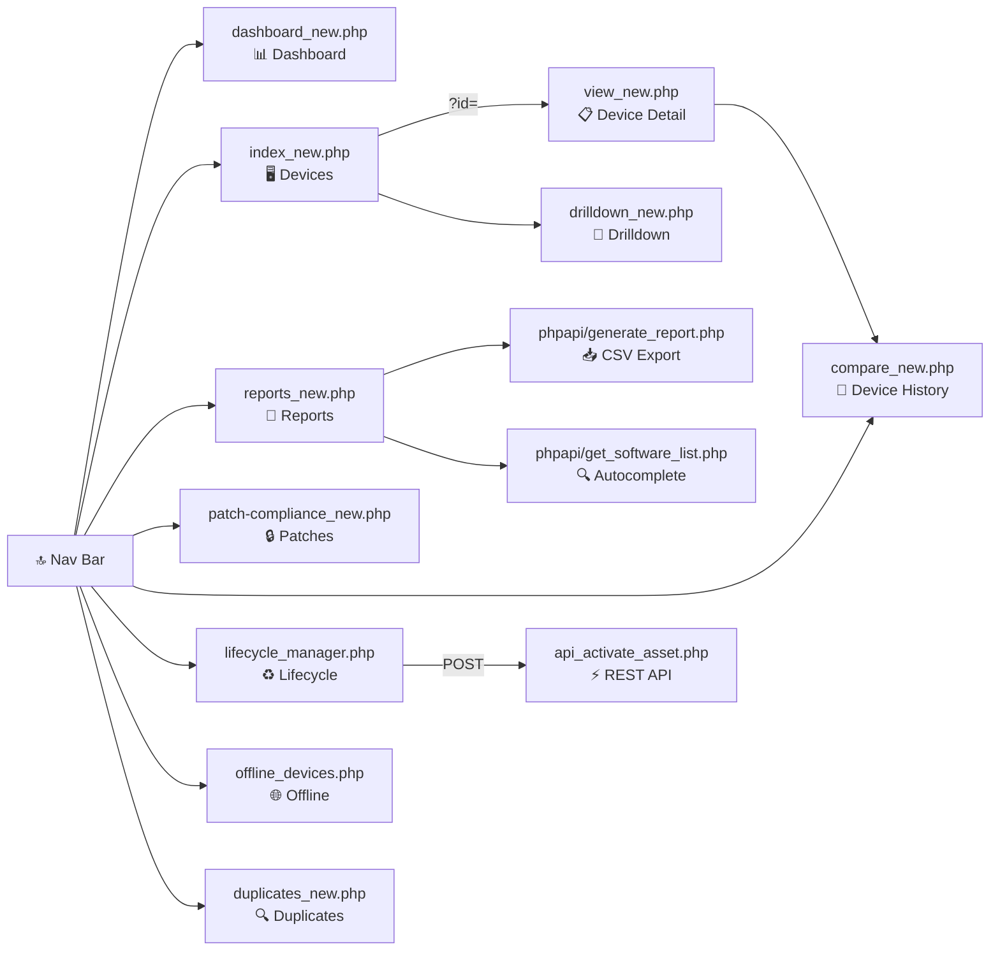
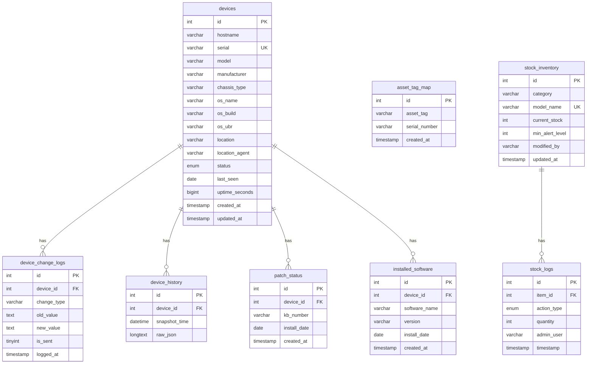
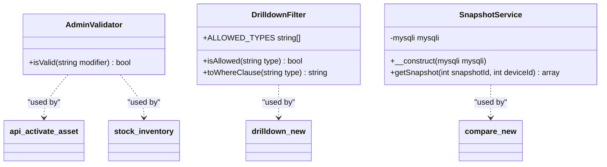

# 🖥️ Enterprise Inventory Agent

A self-hosted, web-based IT asset management system built with PHP 8.1+ and MySQL. It provides real-time dashboards, patch compliance tracking, hardware change auditing, stock management, and Microsoft Teams alerting — all in a single deployable PHP application.

---

## 📋 Table of Contents

- [Features](#-features)
- [Application Architecture](#-application-architecture)
- [Navigation & Pages](#-navigation--pages)
- [Database Schema](#-database-schema)
- [Source Classes](#-source-classes)
- [Tech Stack](#-tech-stack)
- [Setup & Installation](#-setup--installation)
- [Configuration](#-configuration)
- [Automated Alerts (Cron)](#-automated-alerts-cron)
- [Running Tests & Analysis](#-running-tests--analysis)
- [Security Design](#-security-design)
- [Export & Reports](#-export--reports)

---

## ✨ Features

| Module | Description |
|---|---|
| 📊 **Dashboard** | Live KPI cards + 5 interactive Chart.js charts |
| 🖥️ **Device Inventory** | Searchable/sortable active device list with CSV export |
| 🔒 **Patch Compliance** | Flags Compliant / Syncing / Outdated with reboot status |
| 📜 **Device History** | Point-in-time snapshot comparison (JSON diff viewer) |
| 🌐 **Offline Devices** | Devices silent for >7 days — exportable audit list |
| ♻️ **Lifecycle Manager** | Manage In-Store / Scrapped assets; re-activate via admin flow |
| 🔍 **Duplicate Audit** | Detects duplicate hostnames and conflicting asset tags |
| 📦 **Stock Inventory** | Peripheral stock ledger with receive/issue transactions |
| 📑 **Reports Center** | Custom CSV reports (software audit, OS/UBR/manufacturer) |
| 🔔 **Teams Alerting** | Daily cron sends hardware changes + offline device list to MS Teams |

---

## 🏗️ Application Architecture

```
┌─────────────────────────────────────────────────────────────────────┐
│                        Browser / Client                             │
│             Bootstrap 5  ·  Chart.js  ·  Vanilla JS                │
└────────────────────────────┬────────────────────────────────────────┘
                             │  HTTP
                             ▼
┌─────────────────────────────────────────────────────────────────────┐
│                      PHP 8.1 Application                            │
│                                                                     │
│  ┌────────────┐  ┌──────────────┐  ┌─────────────────────────────┐ │
│  │ header /   │  │  Page views  │  │        phpapi/              │ │
│  │ footer     │  │  *.php       │  │  generate_report.php        │ │
│  │ (layout)   │  │  (MVC-lite)  │  │  get_software_list.php      │ │
│  └────────────┘  └──────────────┘  └─────────────────────────────┘ │
│                                                                     │
│  ┌──────────────────────────────────────────────────────────────┐   │
│  │                   src/  (PSR-4 classes)                      │   │
│  │   AdminValidator · DrilldownFilter · SnapshotService         │   │
│  └──────────────────────────────────────────────────────────────┘   │
│                                                                     │
│  config.php ─── vlucas/phpdotenv ─── .env                          │
└────────────────────────────┬────────────────────────────────────────┘
                             │  mysqli (utf8mb4)
                             ▼
┌─────────────────────────────────────────────────────────────────────┐
│                   MySQL / MariaDB Database                          │
│  devices · asset_tag_map · device_change_logs · device_history      │
│  patch_status · installed_software · stock_inventory · stock_logs   │
└─────────────────────────────────────────────────────────────────────┘
                             ▲
                             │ cron (daily)
┌────────────────────────────┴────────────────────────────────────────┐
│  cron_alerts.php  →  Microsoft Teams Adaptive Card Webhook          │
└─────────────────────────────────────────────────────────────────────┘
```

---

## 🗺️ Navigation & Pages



---

## 🗄️ Database Schema



---

## 📦 Source Classes



| Class | Location | Purpose |
|---|---|---|
| `AdminValidator` | `src/AdminValidator.php` | Enforces `-adm` suffix on all stock/activation operations |
| `DrilldownFilter` | `src/DrilldownFilter.php` | Whitelists drilldown types → safe SQL WHERE clauses |
| `SnapshotService` | `src/SnapshotService.php` | Fetches and decodes device history snapshots from the DB |

---

## 🛠️ Tech Stack

| Layer | Technology |
|---|---|
| **Language** | PHP 8.1+ |
| **Database** | MySQL 5.7+ / MariaDB 10.4+ |
| **Frontend** | Bootstrap 5.3, Chart.js, Vanilla JS |
| **Dependency Injection** | `vlucas/phpdotenv` ^5.6 |
| **Autoloading** | PSR-4 via Composer |
| **Static Analysis** | PHPStan level 5 |
| **Testing** | PHPUnit 11 |
| **Alerting** | Microsoft Teams Adaptive Card Webhook |

---

## 🚀 Setup & Installation

### Requirements

- PHP ≥ 8.1 with `ext-mysqli` and `ext-json`
- MySQL 5.7+ or MariaDB 10.4+
- Composer
- A web server (Apache/Nginx) or PHP built-in server for development

### Steps

```bash
# 1. Clone the repository
git clone https://github.com/raparty/InventoryAgent.git
cd InventoryAgent

# 2. Install PHP dependencies
composer install --prefer-dist --no-progress

# 3. Set up environment
cp .env.example .env
# Edit .env with your database credentials

# 4. Set up the database
mysql -u root -p < schema/schema.sql

# 5. Set up config
cp config.php.example config.php
# config.php will auto-load from .env via phpdotenv
```

### Quick start with PHP built-in server (dev only)

```bash
php -S localhost:8080
# Then open http://localhost:8080/dashboard_new.php
```

---

## ⚙️ Configuration

Copy `.env.example` to `.env` and fill in your values:

```ini
DB_HOST=localhost
DB_USER=your_database_user
DB_PASS=your_database_password
DB_NAME=inventory_database

TEAMS_WEBHOOK_URL=your_teams_webhook_url_here

APP_NAME="Enterprise Inventory"
APP_ENV=production          # set to 'development' for verbose errors
```

> **Never commit `.env` or `config.php` with real credentials.** Both are `.gitignore`d by default.

---

## 🔔 Automated Alerts (Cron)

`cron_alerts.php` sends a daily **Microsoft Teams Adaptive Card** containing:

- 🔧 **Hardware changes** – any unsent rows from `device_change_logs`
- 🚨 **Offline devices** – active devices silent for >7 days

```
┌─────────────────────────────────────────────────────────────────┐
│  📅 Daily Inventory Change Summary (2026-04-08)                  │
├─────────────────────────────────────────────────────────────────┤
│  Detected Changes:                                               │
│  • WORKSTATION-42: RAM Change (8GB ➔ 16GB)                      │
│                                                                  │
│  Critical Offline (> 7 Days):                                    │
│  • LAPTOP-07 (HYDW - Laptop) | Last seen: 2026-03-25            │
└─────────────────────────────────────────────────────────────────┘
```

**Recommended cron schedule** (daily at 08:00):

```cron
0 8 * * * /usr/bin/php /var/www/html/InventoryAgent/cron_alerts.php >> /var/log/inventory_alerts.log 2>&1
```

---

## 🧪 Running Tests & Analysis

```bash
# Install dependencies first
make install

# PHP syntax lint (all .php files, excluding vendor/)
make lint

# PHPStan static analysis (level 5)
make analyse

# PHPUnit test suite
make test

# Run everything in one go
make all
```

---

## 🔐 Security Design

```
┌─────────────────────────────────────────────────────────────────┐
│                      Security Layers                            │
├─────────────────────────────────────────────────────────────────┤
│  SQL Injection    │ All queries use prepared statements          │
│                  │ (mysqli::prepare + bind_param)               │
├──────────────────┼──────────────────────────────────────────────┤
│  XSS             │ All output via htmlspecialchars()            │
│                  │ DOM APIs (textContent) used in JS            │
├──────────────────┼──────────────────────────────────────────────┤
│  CSRF            │ Token generated with random_bytes(32)        │
│                  │ Validated with hash_equals() on POST         │
├──────────────────┼──────────────────────────────────────────────┤
│  Admin Actions   │ AdminValidator enforces -adm suffix          │
│                  │ on all stock transactions and activations     │
├──────────────────┼──────────────────────────────────────────────┤
│  Drilldown SQL   │ DrilldownFilter whitelists query types       │
│                  │ — no user input reaches SQL directly          │
├──────────────────┼──────────────────────────────────────────────┤
│  Secrets         │ .env / config.php excluded from version      │
│                  │ control via .gitignore                        │
└──────────────────┴──────────────────────────────────────────────┘
```

---

## 📥 Export & Reports

The **Reports Center** (`reports_new.php`) generates downloadable CSV files:

| Report | Description |
|---|---|
| **Summary Export** | High-level device count snapshot |
| **Full Inventory** | All active device fields |
| **Software Audit** | All devices with a specific installed app |
| **Missing Asset Tags** | Computers or monitors without an asset tag |
| **OS Distribution** | Device count per OS version |
| **UBR Compliance** | Windows Update Build Revision breakdown |
| **Manufacturer Audit** | Fleet grouped by manufacturer |
| **Model Audit** | Fleet grouped by hardware model |

Device and patch list pages also expose per-page **Export CSV** buttons that respect the active filters.

---

## 📂 Project Structure

```
InventoryAgent/
├── assets/
│   └── enterprise_new.css          # Shared stylesheet (Bootstrap overrides)
├── phpapi/
│   ├── generate_report.php         # CSV report generator
│   └── get_software_list.php       # Autocomplete endpoint
├── schema/
│   └── schema.sql                  # Full MySQL schema
├── src/                            # PSR-4 autoloaded classes
│   ├── AdminValidator.php
│   ├── DrilldownFilter.php
│   └── SnapshotService.php
├── tests/                          # PHPUnit test suite
├── api_activate_asset.php          # Asset re-activation REST endpoint
├── compare_new.php                 # Device history diff viewer
├── compare_lookup.php              # Device search for history page
├── config.php.example              # Config template
├── cron_alerts.php                 # Daily Teams alert script
├── dashboard_new.php               # Main dashboard with charts
├── drilldown_new.php               # Filtered drilldown views
├── duplicates_new.php              # Duplicate records audit
├── export_full.php                 # Full CSV export
├── export_single.php               # Single-device export
├── export_summary.php              # Summary CSV export
├── footer.php                      # Shared footer/scripts
├── header_new.php                  # Shared header + nav bar
├── index_new.php                   # Active device list
├── lifecycle_manager.php           # Inactive asset management
├── offline_devices.php             # Devices offline >7 days
├── patch-compliance_new.php        # Windows patch status
├── reports_new.php                 # Reports centre
├── stock_inventory.php             # Stock ledger + transactions
├── view_new.php                    # Single device detail page
├── .env.example                    # Environment variable template
├── .htaccess                       # Apache rewrite / security rules
├── composer.json
├── Makefile                        # lint / analyse / test helpers
└── phpstan.neon                    # PHPStan configuration
```

---

## 📄 License

Proprietary — © raparty. All rights reserved.
